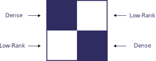
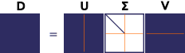
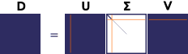

What is HODLR?
==============

Hierarchical Off-Diagonal Low-Rank (HODLR) matrix is a matrix representation
in which a matrix is recursively partitioned into quarters, with the 
off-diagonal blocks stored as low-rank matrices. 

Off-Diagonal
------------

In other words, given a square dense matrix :math:`D`, we construct a HODLR 
matrix :math:`H` by first dividing :math:`D` into 4 blocks:

The two blocks on the diagonal are then stored as dense matrices while the two
*off-diagonal* blocks are compressed and stored as *low-rank* matrices:

.. math::

   H=
   \left[ {\begin{array}{cc}
   {}^{0,0}D & {}^{0,1}U {}^{0,1}V^T \\
   {}^{1,0}U {}^{1,0}V^T & {}^{1,1}D \\
   \end{array} } \right]

where :math:`{}^{i,i}D` is a dense block and :math:`{}^{i,j}U {}^{i,j}V^T` is 
a low-rank block. Visually:

Low-Rank
--------

The dense blocks are simple copies of the blocks of the dense matrix 
:math:`D`, but the low-rank blocks are obtained by compressing the blocks of
:math:`D` using `Singular Value Decomposition`_ (SVD). Using SVD, any real
matrix can be decomposed into:

.. math::

   D = U \Sigma V^T

where :math:`U` and :math:`V^T` are square orthogonal matrices and 
:math:`\Sigma` is a rectangular diagonal matrix containing the singular 
values. The singular values (:math:`\sigma_k = \Sigma_{k,k}`) are real
non-negative numbers and, whem obtained computationally, they usually come 
sorted in descending order (:math:`\Sigma_{k,k} < \Sigma_{k+1,k+1}`). 
Therefore, when performing an SVD of an off-diagonal (``i!=j``) block:

.. math::

   {}^{i,j}D = {}^{i,j}U {}^{i,j}\Sigma {}^{i,j}V^T

where :math:`{}^{i,j}D` is a dense diagonal block of size ``m×n``, 
:math:`{}^{i,j}U` is the ``m×m`` left singular matrix, :math:`{}^{i,j}\Sigma` 
is the ``m×n`` matrix of singular values, and :math:`{}^{i,j}V^T` is the 
``n×n`` right-singular matrix. Visually:

if :math:`D` is indeed structured correctly and suitable for conversion
to HODLR, it will be the case that the singular values, of this off-diagonal
block will decay rapidly (:math:`{}^{i,j}\Sigma_{r,r} \approx 0` for a 
:math:`r << \min(m, n)`). In that case, the decomposition can be written as:

.. math::

   {}^{i,j}D = \sum_{k=0}^{k<r}{{}^{i,j}\sigma_k {}^{i,j}\mathbf{u}_k {}^{i,j}\mathbf{v^T}_k}

where :math:`r` is the number of non-zero singular values, also called 
the **rank** of the matrix. :math:`{}^{i,j}\mathbf{u}_k` is a vector 
representing a column of the :math:`{}^{i,j}U` and 
:math:`{}^{i,j}\mathbf{v^T}_k` is a vector representing a row of the 
:math:`{}^{i,j}V^T` matrix:

Furthermore, it is expected that, due to this decay, the 
singular values quickly become small enough in comparison to the first 
singular value that they can be considered insignificant (
:math:`{}^{i,j}\Sigma_{r',r'} << {}^{i,j}\Sigma_{0,0}` for :math:`r' < r`):

Then, we can discard all the insignificant singular values and truncate the 
:math:`{}^{i,j}U` and :math:`{}^{i,j}V^T` matrices, keeping only a small 
number of columns/rows. This way, the off-diagonal block :math:`{}^{i,j}D` 
is approximated as:

.. math::

   {}^{i,j}D \approx {}^{i,j}\hat{U} {}^{i,j}\hat{\Sigma} {}^{i,j}\hat{V}^T

or

.. math::

   {}^{i,j}D = \sum_{k=0}^{k<r'}{{}^{i,j}\sigma_k {}^{i,j}\mathbf{u}_k {}^{i,j}\mathbf{v^T}_k}

Hierarchical
------------

Lastly, the above procedure can be repeated for the two diagonal blocks:

splitting each block into quarters and compressing the two off-diagonal 
sub-blocks. This can be repeated any number of times, yielding a HODLR matrix:

.. math::

   H = 
   \left[ {\begin{array}{cc}
   {}^{0,0}H & {}^{0,1}U {}^{0,1}V^T \\
   {}^{1,0}U {}^{1,0}V^T & {}^{1,1}H \\
   \end{array} } \right]

.. _Singular Value Decomposition: https://en.wikipedia.org/wiki/Singular_value_decomposition
