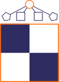
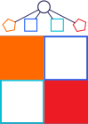
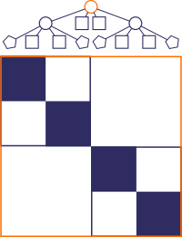
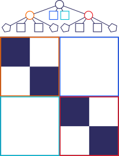
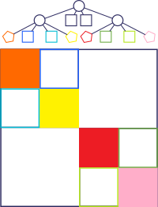

HODLR
*****

In ``hmat_lib``, the :term:`HODLR` matrix is represented using a data 
structure akin to a perfectly balanced binary :term:`tree`, all wrapped in a 
single ``struct``, :c:struct:`TreeHODLR`, that also stores important metadata.
In practice, when using ``hmat_lib``, only this top-level struct should be
interacted with, but this page explains how the entire structure works.

TreeHODLR struct
================

As mentioned, :c:struct:`TreeHODLR` is a wrapper ``struct`` holding the actual
:term:`tree` structure. It has 4 purposes:

1. Wrapping the :term:`tree` by:

   a. Holding a pointer to the :term:`root node`, :c:member:`TreeHODLR.root`
   b. Holding an array of pointers to the :term:`diagonal leaf nodes`,
      :c:member:`innermost_leaves`.

2. Storing metadata such as the :term:`height` of the tree 
   (:c:member:`TreeHODLR.height`)

3. Holding workspace arrays used in most operations on the tree, such as
   :c:member:`TreeHODLR.work_queue`

4. Storing information internal to the library, primarily used for memory 
   management (e.g. :c:member:`TreeHODLR.memory_leaf_ptr`).

Nodes
=====

Conceptually, there are three types of nodes that make up a :term:`HODLR`
:term:`tree` (unlike a binary tree):

.. _internal-node-explanation:

1. :term:`internal node` is a node that represents a recursive :term:`HODLR` 
   component (:math:`{}^{i,i}H`). It has :term:`children` (always four of 
   them, again unline a binary tree) and forms the backbone of the 
   :term:`tree`, connecting all the nodes, but holds no data.

.. _diagonal-node-explanation:

2. :term:`diagonal leaf node` is a node that represents a diagonal dense block
   of the :term:`HODLR` (:math:`{}^{i,i}D`). It has no :term:`children`
   (it is a terminal node) but stores a dense matrix.

.. _offdiagonal-node-explanation:

3. :term:`off-diagonal leaf node` is a node that represents an off-diagonal
   low-rank block of the :term:`HODLR` (:math:`{}^{i,j}U {}^{i,j}V^T`). It has
   no :term:`children` (it is a terminal node) but stores a low-rank matrix.

In a table format:

============================== ============================= ======== ======== =======================================================
Node                           Block                         Children Data     Struct(s)
============================== ============================= ======== ======== =======================================================
:term:`internal node`          :math:`{}^{i,i}H`             4        none     :c:struct:`HODLRInternalNode`
:term:`diagonal leaf node`     :math:`{}^{i,i}D`             0        dense    :c:struct:`HODLRLeafNode` & :c:struct:`NodeDiagonal`
:term:`off-diagonal leaf node` :math:`{}^{i,j}U {}^{i,j}V^T` 0        low-rank :c:struct:`HODLRLeafNode` & :c:struct:`NodeOffDiagonal`
============================== ============================= ======== ======== =======================================================

HODLR tree
==========

These :term:`nodes` are assembled in the following way to form the 
:term:`tree` data structure:

* The :term:`root node` is always an :term:`internal node` 
  (:c:struct:`HODLRInternalNode`)

* Each :term:`internal node` stores three types of information:

  * The size of the matrix block represented by the internal node,
    :c:member:`HODLRInternalNode.m`

  * Pointer to the node's :term:`parent`. This is ``NULL`` for the 
    :term:`root node`.

  * The four :term:`children` that each internal node has:

    1. The first child represents the top left diagonal block and is always 
       either:

       a. A :term:`diagonal leaf node`, storing a dense matrix, if the 
          :term:`children` are on the highest (last) :term:`level`.

       b. Another :term:`internal node`, storing a :term:`HODLR` 
          :term:`subtree`, otherwise.

    2. The second child is always an :term:`off-diagonal leaf node`, storing
       the :term:`low-rank matrix` representation of the top right 
       off-diagonal block.

    3. The third child is always  an :term:`off-diagonal leaf node`, storing
       the :term:`low-rank matrix` representation of the bottom left
       off-diagonal block.

    4. The fourth child represents the bottom right diagonal block and is
       always either:

       a. A :term:`diagonal leaf node`, storing a dense matrix, if the 
          :term:`children` are on the highest (last) :term:`level`.

       b. Another :term:`internal node`, storing a :term:`HODLR` 
          :term:`subtree`, otherwise.

In short, the :term:`tree` consists of a series of :term:`internal nodes`
representing the recursive structure of the :term:`HODLR` matrix, each of 
which also has two :term:`children` :term:`off-diagonal leaf nodes`. The 
penultimate level :term:`internal nodes` have two :term:`diagonal leaf node`
:term:`children` instead of the :term:`internal nodes`, terminating the 
:term:`tree`.

Examples
--------

Hieght 1 tree
^^^^^^^^^^^^^

A :term:`tree` of :term:`height` equal to ``1`` consists of one :term:`root`
:term:`internal node`:

which has four children:

1. A :term:`diagonal leaf node` storing the top left block in a dense format.
2. An :term:`off-diagonal leaf node` storing the top right block in a low-rank
   format.
3. An :term:`off-diagonal leaf node` storing the bottom left block in a 
   low-rank format.
4. A :term:`diagonal leaf node` storing the bottom right block in a dense 
   format.

In this case, the first and fourth :term:`children` are 
:term:`diagonal leaf nodes`, since the first level is the last one. Therefore,
they store the respective blocks of the matrix as dense matrices.

Height 2 tree
^^^^^^^^^^^^^

A :term:`tree` of :term:`height` equal to ``2`` also starts with one 
:term:`root` :term:`internal node`:

which has four children:

1. An :term:`internal node` storing the top left block in a :term:`HODLR` 
   format.
2. An :term:`off-diagonal leaf node` storing the top right block in a low-rank
   format.
3. An :term:`off-diagonal leaf node` storing the bottom left block in a 
   low-rank format.
4. An :term:`internal node` storing the bottom right block in a :term:`HODLR` 
   format.

In this case, the first and fourth :term:`children` are :term:`internal nodes` 
and therefore, instead of storing the respective blocks as dense matrices,
they store them as :term:`HODLR` matrices. As such, each one has four
:term:`children` of its own, for :term:`node` 1 this is:

1. A :term:`diagonal leaf node` storing the top left block of the top left 
   block in a dense format.
2. An :term:`off-diagonal leaf node` storing the top right block of the top 
   left block in a low-rank format.
3. An :term:`off-diagonal leaf node` storing the bottom left block of the top
   left block in a low-rank format.
4. A :term:`diagonal leaf node` storing the bottom right block of the top left
   block in a dense format.

and for :term:`node` 2:

A. A :term:`diagonal leaf node` storing the top left block of the bottom right
   block in a dense format.
B. An :term:`off-diagonal leaf node` storing the top right block of the bottom
   right block in a low-rank format.
C. An :term:`off-diagonal leaf node` storing the bottom left block of the 
   bottom right block in a low-rank format
D. A :term:`diagonal leaf node` storing the bottom right block of the bottom
   right block in a dense format.

