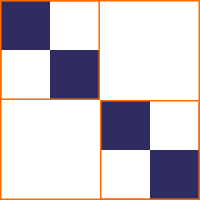
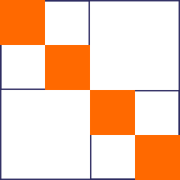
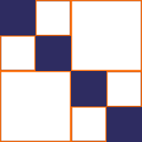
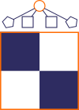
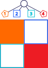
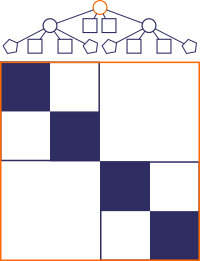
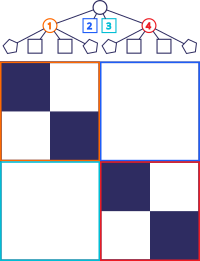
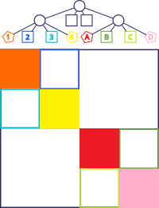

HODLR
*****

In ``hmat_lib``, the :term:`HODLR` matrix is represented using a data 
structure akin to a perfectly balanced binary :term:`tree`, all wrapped in a 
single ``struct``, :c:struct:`TreeHODLR`, that also stores important metadata.
In practice, when using ``hmat_lib``, only this top-level struct should be
interacted with, but this page explains how the entire structure works.

TreeHODLR struct
================

As mentioned, :c:struct:`TreeHODLR` is a wrapper ``struct`` holding the actual
:term:`tree` structure. It has 4 purposes:

1. Wrapping the :term:`tree` by:

   a. Holding a pointer to the :term:`root node`, :c:member:`TreeHODLR.root`
   b. Holding an array of pointers to the :term:`diagonal leaf nodes`,
      :c:member:`innermost_leaves`.

2. Storing metadata such as the :term:`height` of the tree 
   (:c:member:`TreeHODLR.height`)

3. Holding workspace arrays used in most operations on the tree, such as
   :c:member:`TreeHODLR.work_queue`

4. Storing information internal to the library, primarily used for memory 
   management (e.g. :c:member:`TreeHODLR.memory_leaf_ptr`).

Nodes
=====

Conceptually, there are three types of nodes that make up a :term:`HODLR`
:term:`tree` (unlike a binary tree):

.. _internal-node-explanation:

1. :term:`internal node` is a node that represents a recursive :term:`HODLR` 
   component (:math:`{}^{i,i}H`). It has :term:`children` (always four of 
   them, again unlike a binary tree) and forms the backbone of the 
   :term:`tree`, connecting all the nodes, but holds no data.

.. _diagonal-node-explanation:

2. :term:`diagonal leaf node` is a node that represents a diagonal dense block
   of the :term:`HODLR` (:math:`{}^{i,i}D`). It has no :term:`children`
   (it is a terminal node) but stores a dense matrix.

.. _offdiagonal-node-explanation:

3. :term:`off-diagonal leaf node` is a node that represents an off-diagonal
   low-rank block of the :term:`HODLR` (:math:`{}^{i,j}U {}^{i,j}V^T`). It has
   no :term:`children` (it is a terminal node) but stores a low-rank matrix.

In a table format:

============================== ============================= ======== ======== =======================================================
Node                           Block                         Children Data     Struct(s)
============================== ============================= ======== ======== =======================================================
:term:`internal node`          :math:`{}^{i,i}H`             4        none     :c:struct:`HODLRInternalNode`
:term:`diagonal leaf node`     :math:`{}^{i,i}D`             0        dense    :c:struct:`HODLRLeafNode` & :c:struct:`NodeDiagonal`
:term:`off-diagonal leaf node` :math:`{}^{i,j}U {}^{i,j}V^T` 0        low-rank :c:struct:`HODLRLeafNode` & :c:struct:`NodeOffDiagonal`
============================== ============================= ======== ======== =======================================================

Internal node
-------------

An :term:`internal node` represents a :term:`HODLR` (sub)matrix, i.e. if a 
HODLR matrix is defined as:

.. math::

   H=
   \left[ {\begin{array}{cc}
   {}^{0,0}H & {}^{0,1}U {}^{0,1}V^T \\
   {}^{1,0}U {}^{1,0}V^T & {}^{1,1}H \\
   \end{array} } \right]

then :math:`{}^{0,0}H` and :math:`{}^{1,1}H` would be represented using 
internal nodes:

         the two HODLR submatrices highlighted.

In ``hmat_lib``, it is represented via the :c:struct:`HODLRInternalNode` 
``struct`` which does not store any data, only pointers to its four children:

1. Top-left diagonal block
2. Top-right off-diagonal block
3. Bottom-left off-diagonal block
4. Bottom-right diagonal block

.. _internal-node-children-middle:

In the above case, where the internal node is in the middle of the tree
(``level < height=1``), this would be:

1. Another internal node storing a HODLR subtree (:math:`{}^{0,0}H`)
2. An off-diagonal leaf node (:math:`{}^{0,1}U {}^{0,1}V^T`)
3. An off-diagonal leaf node (:math:`{}^{1,0}U {}^{1,0}V^T`)
4. Another internal node storing a HODLR subtree (:math:`{}^{1,1}H`)

However, the last internal nodes (second-to-last level, which is the last 
level with internal nodes, ``level == height - 1``), which take the form:

.. math::

   H=
   \left[ {\begin{array}{cc}
   {}^{0,0}D & {}^{0,1}U {}^{0,1}V^T \\
   {}^{1,0}U {}^{1,0}V^T & {}^{1,1}D \\
   \end{array} } \right]

.. _internal-node-children-bottom:

the four children would instead be:

1. A diagonal leaf node (:math:`{}^{0,0}D`)
2. An off-diagonal leaf node (:math:`{}^{0,1}U {}^{0,1}V^T`)
3. An off-diagonal leaf node (:math:`{}^{1,0}U {}^{1,0}V^T`)
4. A diagonal leaf node (:math:`{}^{1,1}D`)

Information stored on the node
^^^^^^^^^^^^^^^^^^^^^^^^^^^^^^

* Pointer to its parent (``NULL``) if the node is the :term:`root node`.
* Size of the HODLR submatrix
* Pointers to its four children (as specified above).

Diagonal leaf node
------------------

A :term:`diagonal leaf node` represents a dense block, i.e. if a :term:`HODLR` 
(sub)matrix is defined as:

.. math::

   {}^{i,i}H=
   \left[ {\begin{array}{cc}
   {}^{0,0}D & {}^{0,1}U {}^{0,1}V^T \\
   {}^{1,0}U {}^{1,0}V^T & {}^{1,1}D \\
   \end{array} } \right]

then :math:`{}^{0,0}D` and :math:`{}^{1,1}D` would be represented using 
diagonal leaf nodes:

         highlighted.

In ``hmat_lib``, it is represented via the :c:struct:`HODLRLeafNode` struct 
with its :c:member:`HODLRLeafNode.data` field being the 
:c:struct:`NodeDiagonal`. It stores the diagonal block of the HODLR matrix as 
a single contiguous, column-major array.

Information stored on the node
^^^^^^^^^^^^^^^^^^^^^^^^^^^^^^

* Pointer to its parent (always an internal node).
* Size of the block it stores.
* The dense matrix.

Off-diagonal leaf node
----------------------

An :term:`off-diagonal leaf node` represents a low-rank off-diagonal 
block, i.e. if a :term:`HODLR` (sub)matrix is defined as:

.. math::

   {}^{i,i}H=
   \left[ {\begin{array}{cc}
   {}^{0,0}H & {}^{0,1}U {}^{0,1}V^T \\
   {}^{1,0}U {}^{1,0}V^T & {}^{1,1}H \\
   \end{array} } \right]

then :math:`{}^{0,1}U {}^{0,1}V^T` and :math:`{}^{0,1}U {}^{0,1}V^T` would be 
represented using off-diagonal leaf nodes:

         highlighted.

In ``hmat_lib``, it is represented via the :c:struct:`HODLRLeafNode` struct 
with its :c:member:`HODLRLeafNode.data` field being the 
:c:struct:`NodeOffDiagonal` struct. It stores the off-diagonal block in the
:term:`low-rank format` by storing the :math:`U` and :math:`V^T` matrices:

* The :math:`U` matrix is stored 
  :ref:`scaled by the singular values<u-scaling>` (i.e. :math:`U' = U \Sigma`) 
  as a single contiguous, column-major array.

  * This saves memory since the :math:`\Sigma` array does not need to be 
    stored and also avoids recomputing the scaling every time the node is used
    for computation.

* The :math:`V^T` matrix is stored transposed (i.e. :math:`V`) as a single
  contiguous, column-major array.

  * There is not a strong reason for this approach - either way works fine 
    since in some operations :math:`V` is used and in some :math:`V^T` is.

Information stored on the node
^^^^^^^^^^^^^^^^^^^^^^^^^^^^^^

* Pointer to its parent (always an internal node).
* The dimensions of the matrix it stores.
* The rank of the matrix.
* The low-rank matrix.

HODLR tree
==========

The above :term:`nodes` are assembled in the following way to form the 
:term:`tree` data structure:

1. The tree starts with a :term:`root node`, which is always an 
   :term:`internal node`.

2. The :term:`internal node` has four children:

   a. If the current level is not the 
      :ref:`second-to-last one<internal-node-children-middle>` 
      (``level < height-1``):

      * Nodes 1 and 4 are internal nodes (go back to 2.).
      * Nodes 2 and 3 are off-diagonal leaf nodes, formed by compressing the
        off-diagonal blocks.

   b. If the current level *is* the 
      :ref:`second-to-last one<internal-node-children-bottom>`
      (``level == height-1``):

      * Nodes 1 and 4 are diagonal leaf nodes, formed by copying the dense 
        blocks.
      * Nodes 2 and 3 are off-diagonal leaf nodes, formed by compressing the
        off-diagonal blocks.

In short, the :term:`tree` consists of a series of :term:`internal nodes`
representing the recursive structure of the :term:`HODLR` matrix, each of 
which also has two :term:`children` :term:`off-diagonal leaf nodes`. The 
penultimate level :term:`internal nodes` have two :term:`diagonal leaf node`
:term:`children` instead of the :term:`internal nodes`, terminating the 
:term:`tree`.

Examples
--------

Height 1 tree
^^^^^^^^^^^^^

A :term:`tree` of :term:`height` equal to ``1`` consists of one :term:`root`
:term:`internal node`:

         showing one parent node above four children nodes. The parent node
         and the outline of the HODLR are highlighted.

which has four children:

1. A :term:`diagonal leaf node` storing the top left block in a dense format.
2. An :term:`off-diagonal leaf node` storing the top right block in a low-rank
   format.
3. An :term:`off-diagonal leaf node` storing the bottom left block in a 
   low-rank format.
4. A :term:`diagonal leaf node` storing the bottom right block in a dense 
   format.

         top left block, the second child node highlighted with the top right
         block, the third with the bottom left block, and the fourth with the
         bottom right block.

In this case, the first and fourth :term:`children` are 
:term:`diagonal leaf nodes`, since the first level is the last one. Therefore,
they store the respective blocks of the matrix as dense matrices.

Height 2 tree
^^^^^^^^^^^^^

A :term:`tree` of :term:`height` equal to ``2`` also starts with one 
:term:`root` :term:`internal node`:

         diagram, in which the root node has four children, the first and
         fourth of which have four children of their own. The root node and
         the HODLR outline are highlighted.

which has four children:

1. An :term:`internal node` storing the top left block in a :term:`HODLR` 
   format.
2. An :term:`off-diagonal leaf node` storing the top right block in a low-rank
   format.
3. An :term:`off-diagonal leaf node` storing the bottom left block in a 
   low-rank format.
4. An :term:`internal node` storing the bottom right block in a :term:`HODLR` 
   format.

         corresponding HODLR blocks highlighted.

In this case, the first and fourth :term:`children` are :term:`internal nodes` 
and therefore, instead of storing the respective blocks as dense matrices,
they store them as :term:`HODLR` matrices. As such, each one has four
:term:`children` of its own, for :term:`node` 1 this is:

1. A :term:`diagonal leaf node` storing the top left block of the top left 
   block in a dense format.
2. An :term:`off-diagonal leaf node` storing the top right block of the top 
   left block in a low-rank format.
3. An :term:`off-diagonal leaf node` storing the bottom left block of the top
   left block in a low-rank format.
4. A :term:`diagonal leaf node` storing the bottom right block of the top left
   block in a dense format.

and for :term:`node` 2:

A. A :term:`diagonal leaf node` storing the top left block of the bottom right
   block in a dense format.
B. An :term:`off-diagonal leaf node` storing the top right block of the bottom
   right block in a low-rank format.
C. An :term:`off-diagonal leaf node` storing the bottom left block of the 
   bottom right block in a low-rank format
D. A :term:`diagonal leaf node` storing the bottom right block of the bottom
   right block in a dense format.

         HODLR blocks highlighted.

